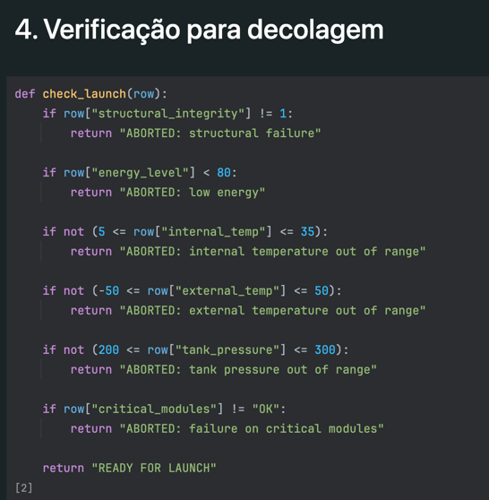
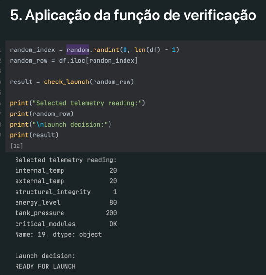

# 🚀 Sistema de Análise de Prontidão para Decolagem

## 📌 Descrição do Projeto

Este projeto simula um sistema de decisão para pré-decolagem baseado em dados de telemetria. O objetivo é determinar se o sistema está **READY FOR LAUNCH** ou se a decolagem deve ser **ABORTED**, com base em limites de segurança previamente definidos.

O projeto foi desenvolvido como parte da *Atividade Integradora – Fase 1* do curso de Ciência da Computação da FIAP.

A solução utiliza:
- Dados de telemetria simulados (gerados com auxílio de IA)
- Algoritmo de validação baseado em regras de segurança
- Python com Pandas para processamento de dados
- Análise energética
- Análise assistida por Inteligência Artificial

---

## 📊 Dados de Telemetria

Os dados foram gerados com o auxílio de Inteligência Artificial para simular condições realistas de pré-decolagem, incluindo cenários normais e com falhas.

O arquivo utilizado está disponível em:
_launch_telemetry_data.csv_

Cada leitura contém os seguintes campos:

- `internal_temp`
- `external_temp`
- `structural_integrity`
- `energy_level`
- `tank_pressure`
- `critical_modules`

---

## ⚙️ Regras de Validação

O sistema utiliza os seguintes limites operacionais:

- Temperatura interna: 5°C a 35°C  
- Temperatura externa: -50°C a 50°C  
- Integridade estrutural: 1 (OK)  
- Energia mínima: 80%  
- Pressão dos tanques: 200 a 300 bar  
- Módulos críticos: OK  

Caso qualquer um desses parâmetros esteja fora dos limites, a decolagem é abortada.

---

## 🧠 Funcionamento do Sistema

O sistema realiza as seguintes etapas:

1. Carrega os dados de telemetria a partir de um arquivo CSV
2. Seleciona uma leitura aleatória (simulando tempo real)
3. Aplica as regras de validação
4. Retorna o resultado da decisão:
   - `READY FOR LAUNCH`
   - `ABORTED`

## ▶️ Exemplo de Saída

1. Carrega os dados de telemetria a partir de um arquivo CSV

2. Define a função de validação

3. Aplica a validação e apresenta o resultado

